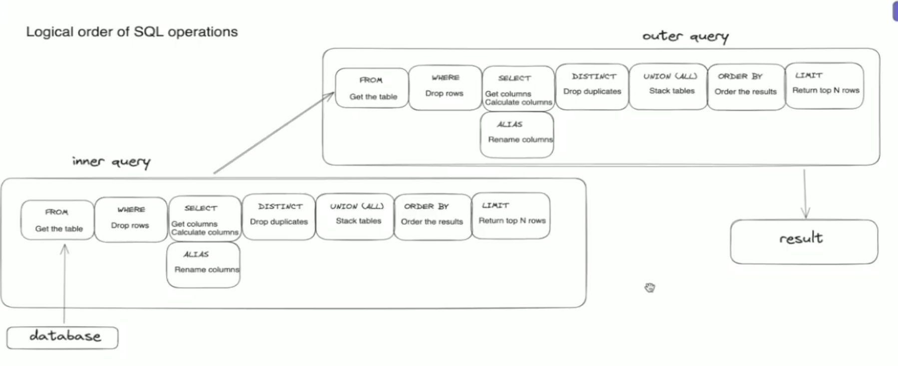

## Common Table Expressions



- When there is multiple nested subqueries it affects the readability of the query
- This can be solved by Common Table Expressions
- When you want to query without using table subqueries is helpful but it can get messy
- Example of subqueries without directly querying table :

```sql
SELECT *
FROM
(SELECT name,level,
  CASE
    WHEN class ='Mage' THEN level*0.5
    WHEN class IN ('Archer','Warrior') THEN level*0.75
    ELSE level*1.5
  END AS power_level
FROM fantasy.characters)
WHERE power_level>=15
```

**WRITING ABOVE SUBQUERY AS COMMON TABLE EXPRESSIONS**

```sql
WITH power_level_table AS (SELECT name,level,
  CASE
    WHEN class ='Mage' THEN level*0.5
    WHEN class IN ('Archer','Warrior') THEN level*0.75
    ELSE level*1.5
  END AS power_level
FROM fantasy.characters
)
SELECT *
FROM power_level_table
WHERE power_level>=15
```

1. Take the logic and put it in first line
2. prefix it with WITH and a tablename alias so that it creates virtual table
3. lastly select the alias name of the table to query it
4. We can have multiple common table expressions
5. Order of common table expressions matter as common table expression can only reference common table expression before it

# When to use subquery and When to use common table expression

- Everytime you need to define a table use common table expression
-
