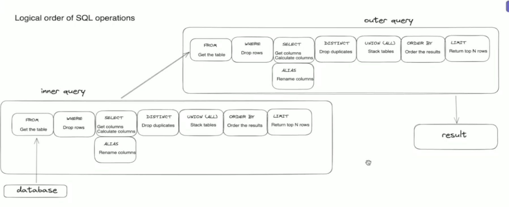

## SUBQUERIES

- Subqueries solve a very specific problem : you cannot get the result you require with a single query
- You start subqueries with round brackets
- used when you need computed values to be used on a query
- We can use SUBQUERIES and common table expression to return new tables as well

# Uncorrelated subquery

- Where computed values are fixed and used for all records and doesn't hit on the performance
- Whole dataset has same value

```sql
-- find characters whose experience is between min and max
-- more experience than the least experience character and less experience than the most experience character

SELECT name , experience
FROM fantasy.characters
WHERE experience >(SELECT min(experience) FROM fantasy.characters) AND experience<(SELECT max(experience) FROM fantasy.characters)
```

# Correlated subquery

- Values returned by this subquery needs to computed dynamically for every record or row
- It is different for every row
- SQL has to recompute for every row and thus called correlated subquery
- **Correlated Subqueries are slower and more expensive to run**

```sql
-- find difference between characters experience and their mentor's

SELECT  id AS mentee_id,mentor_id,
(SELECT experience FROM fantasy.characters AS mentor_table WHERE id = mentee_table.mentor_id)-experience
FROM fantasy.characters mentee_table
WHERE mentor_id IS NOT NULL
```

# Inner query execution


