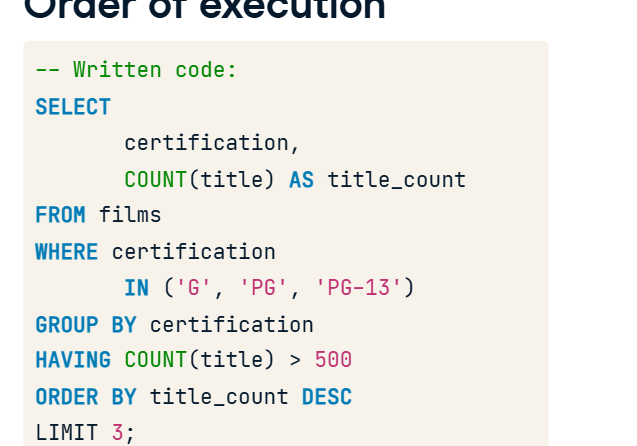

## FILTERING AND GROUPING

- In SQL we cant filter aggregate functions with WHERE clauses
- To filter aggregate functions we use HAVING clause

# HAVING

```sql
SELECT release_year,
    COUNT(title) AS title_count
FROM films
GROUP BY release_year
HAVING count(title) > 10;
```



## ORDER OF EXECUTION WITH WHERE AND ALIAS and ORDER BY and GROUP BY and HAVING

- FROM
- WHERE
- GROUP BY
- HAVING
- SELECT and aliases
- ORDER BY
- LIMIT

- By reviewing this order, we can see WHERE is executed before GROUP BY and before any aggregation occurs. This order is also why we cannot use the alias with HAVING, but we can with ORDER BY.

## HAVING VS WHERE

- WHERE filters individual records while HAVING filters grouped records
- What films were released in year 2000; individual question with no need of grouping so we use WHERE
- In what years was the average film duration over two hours?". Straight away, we can see this question has a few more layers. : HAVING
