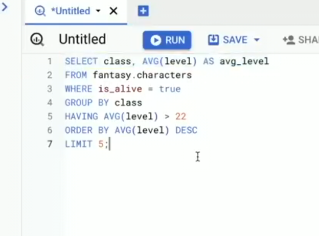
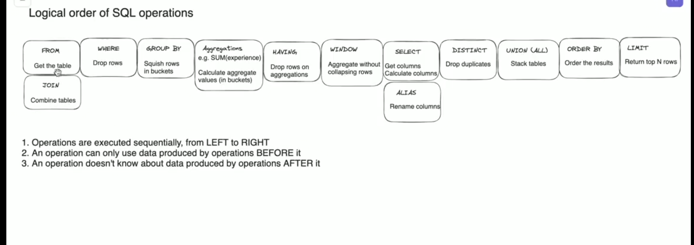

## SQL is not processed in the order its written

# Order of SQL Clauses

- **Lexical Order** Order in which clauses are written.
  
- **Logical Order** Order in which clauses are executed logically.

- **Effective Order** True order of execution after the engine's optimizations.

-- Order of execution

1. **FROM people**
2. SELECT name
3. Keywords that refine the results

**Aliases are declared in the SELECT statement**

## ORDER OF EXECUTION WITH WHERE AND ALIAS and ORDER BY and GROUP BY and HAVING clause

- FROM
- WHERE
- GROUP BY
- HAVING
- SELECT and aliases
- ORDER BY
- LIMIT
