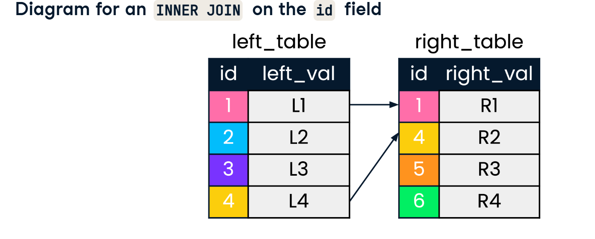
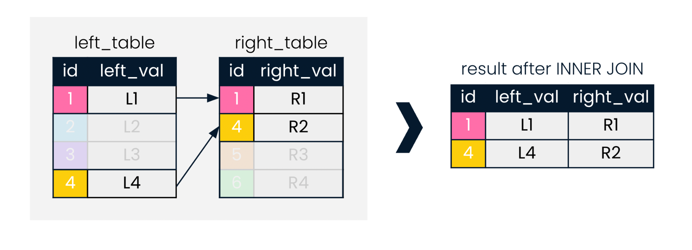
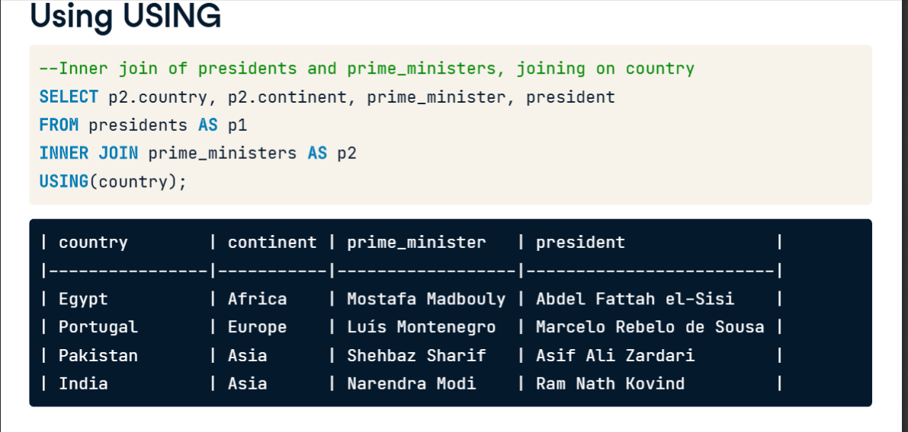

## INNER JOIN


- ID field is the key
- **key** is the single column or group of columns that uniquely identify the records in a table
- Inner join looks for record on both table which match a given field
- Diagram of inner join on ID field -
- result after inner join
- 

```sql
--Inner join of presidents and prime ministers, joining on country
SELECT prime_ministers.country,prime_ministers.continent,prime_ministers,president
FROM presidents
INNER JOIN prime_ministers
ON presidents.country = prime_ministers.country
```

- It is common to begin constructing the query with the join first, and selecting fields later. After FROM, we list the left table, followed by the INNER JOIN keyword and the right table. We then specify the field to match the tables on, using the ON keyword. Here, we use the "country" field. Lastly, we add SELECT at the start of the query and choose the fields we want returned.
- **When selecting columns that exist in both tables, such as "country" and "continent", the table-dot-column_name format must be used to avoid a SQL error.**


